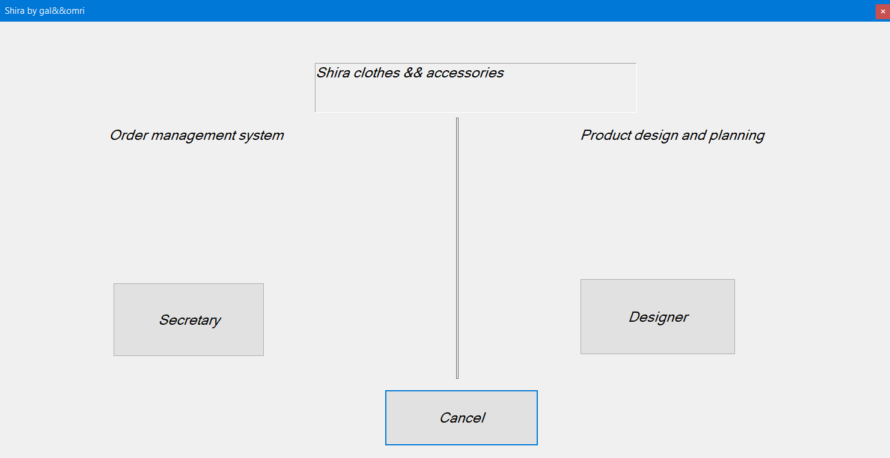
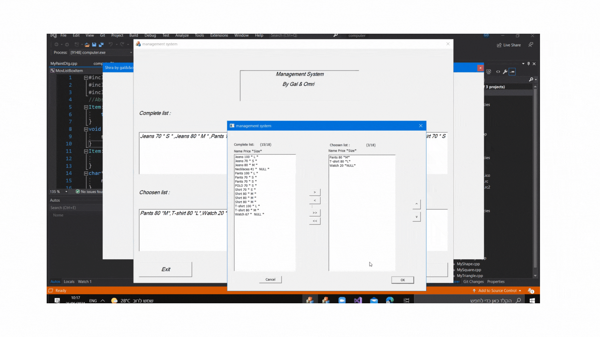
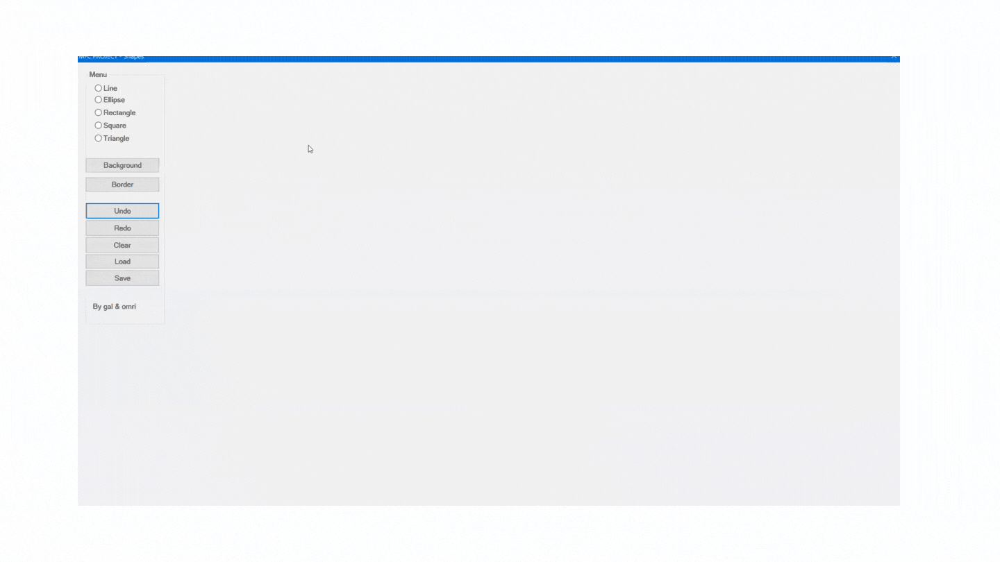

# Store-Management In C++
This project is based on the MFC framework, final project in OOP.

Store management system

The goal of this project is to system optimization shop with specs:
* Language: `C++` 
* Librarie: `STL` 
* Framework: `MFC` 

Store management system clothes and accessories includes :

  

# Order management system

#### Structure

    ├── Item                   # Abstract class
    |    |    ├── Clothes      #Price by size
    |    |    ├──Pants                     
    |    |    ├──Shirt         
    |    ├── Jewel            # Dynamic cast on size ,Jewelry has no size
    └── README.md

  

 
# Designer

- basic drawings: `Lines` ,`Rectangles`, `Circles`, `Ellipses`. 

    Options to choose:

* Background and Border

* Undo, Redo and clear

* Load and Save

  

